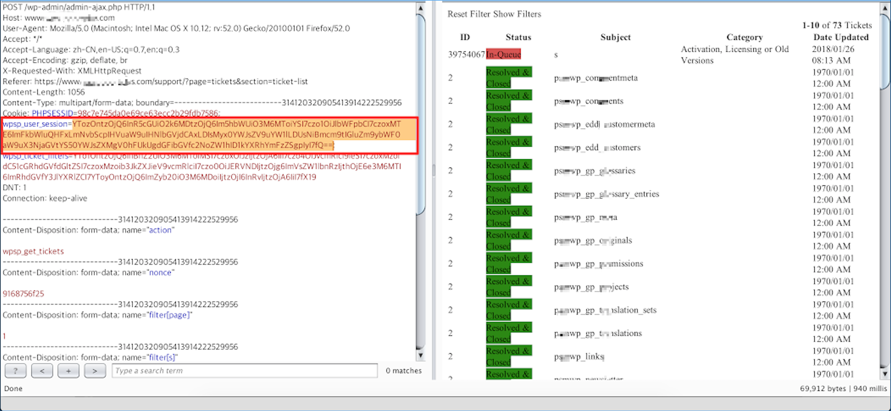

there is a sql inject in the cookie value email and the post parameter "filter[order_by]".

there is a picture for the test of the official website of responsive-ticket-system.

the cookie is base64 encoded,a php serialized object.
and the parameter email in cookie was inject.

the post parameter "filter[order_by]" was inject too but is blind.
